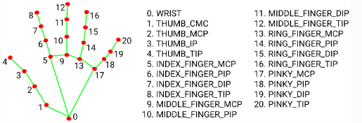

# Assignment

Using media pipe hand landmark model

# Photoshop

### Negate:
+ Inverts the RGB values (substracting from 255) of each image
+ Alpha channel unchanged

### Grayscale:
+ Converts RGB values to grayscale using the luminance formula
    + `0.299 * R + 0.587 * G + 0.114 * B`
+ Alpha channel unchanged

### Gamma Transformation:
+ Using the gamma correction formula
    + `output = 255 * (input / 255)^(1 / gamma)`
+ Adjusts the pixel intensity levels based on the `gamma_value` parameter
+ Brightens or Darkens a picture

### Logarithmic Transformation:
+ Using logarithmic formula
    + `c = 255 / log(1 + 255)`
+ Enhance the details in the darker regions of the image

### Historgram Creation:
+ Plots the pixel values using Matplotlib
+ Flattens the RGB channels and displays the distribution of pixel intensities

### Histogram Equalization:
+ Applies to each RGB channels
+ Using OpenCV's `equalizeHist` function
+ Redistributes pixel intensities to increase image contrast

### Box Filter (Mean Filter):
+ Applies 5x5 box filter to smooth the image
+ Using OpenCV's `blur` function to average pixel values over the kernel area
+ Reduces noise and detail

### Gauss Filter:
+ Applies Gaussian filter
+ Using `scipy.ndimage.gaussian_filter` with the sigma of 2
+ Blurs the image while preserving edges better than box filter

### Sobel Edge Detection:
+ First converts the image to grayscale 
+ Applies the Sobel kernel both in the `x` and `y` directions
    + `x = [[-1, 0, 1], [-2, 0, 2], [-1, 0, 1]]`
    + `y = [[-1, -2, -1], [0, 0, 0], [1, 2, 1]]`
+ Combines the gradient magnitude image, highlighting the edges

### Laplace Edge Detection:
+ First converts the image to grayscale
+ Applies the Laplacian kernel
    + `[[0, 1, 0], [1, -4, 1], [0, 1, 0]]`
+ For optimization using `cv2.Laplacian`

### Corner Detection:
+ Detects corners in grayscale images
+ Using the Shi-Tomasi method (variant of the Lucas-Kanade algorithm)
+ Using `cv2.goodFeaturesToTrack`
    + Identifies strong corners based on quality and minimum distance
    + Detected corners are marked with red circles
